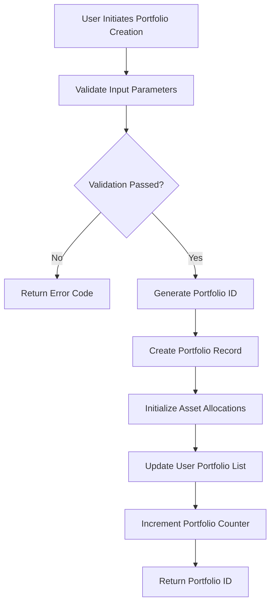
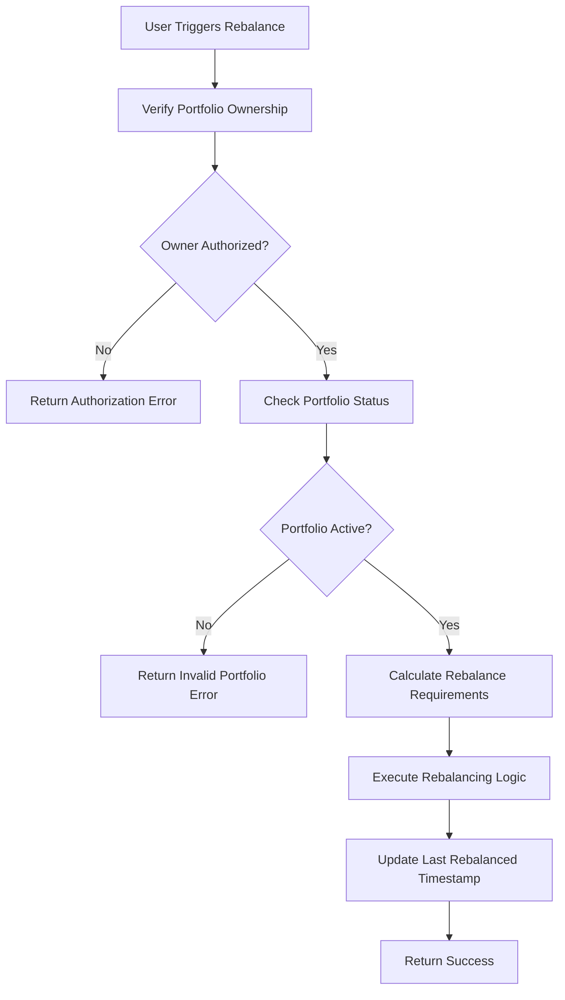
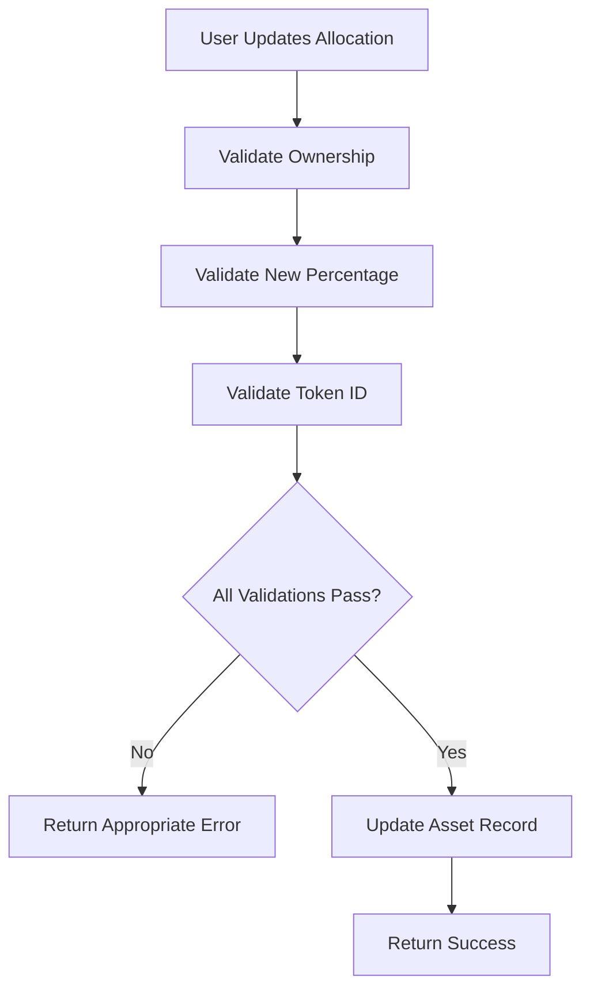

# StackVault - Bitcoin Layer 2 Portfolio Manager

[](https://stacks.co)
[](https://clarity-lang.org)

## Overview

StackVault Pro is an enterprise-grade decentralized portfolio management protocol engineered for Bitcoin Layer 2 ecosystems. Built on the Stacks blockchain, it delivers institutional-level asset allocation strategies while maintaining Bitcoin's inherent security guarantees and core principles of self-custody and decentralization.

### Key Features

- **Multi-Asset Portfolio Management**: Support for up to 10 different tokens per portfolio
- **Intelligent Rebalancing**: Automated portfolio rebalancing with configurable thresholds
- **Precision Allocation Controls**: Basis point-level allocation precision (0.01%)
- **Comprehensive Risk Management**: Built-in validation and authorization controls
- **Bitcoin Security**: Leverages Bitcoin's security model through Stacks integration
- **Self-Custody**: Users maintain full control of their assets

## System Architecture

### High-Level Architecture

```
┌─────────────────────────────────────────────────────────────┐
│                     StackVault Protocol                     │
├─────────────────────────────────────────────────────────────┤
│  Portfolio Management Layer                                 │
│  ├── Portfolio Creation & Management                        │
│  ├── Asset Allocation Engine                               │
│  ├── Rebalancing Algorithm                                 │
│  └── Risk Management System                                │
├─────────────────────────────────────────────────────────────┤
│  Data Storage Layer                                         │
│  ├── Portfolio Registry                                     │
│  ├── Asset Mapping                                         │
│  └── User Portfolio Tracking                               │
├─────────────────────────────────────────────────────────────┤
│  Security & Authorization Layer                             │
│  ├── Ownership Validation                                  │
│  ├── Permission Controls                                   │
│  └── Input Validation                                      │
├─────────────────────────────────────────────────────────────┤
│               Stacks Blockchain Layer                       │
│            (Bitcoin Settlement Layer)                       │
└─────────────────────────────────────────────────────────────┘
```

### Contract Architecture

The StackVault smart contract is structured with a modular design pattern:

#### Core Components

1. **Portfolio Engine**
   - Portfolio lifecycle management
   - Asset allocation logic
   - Rebalancing mechanisms

2. **Data Management**
   - Efficient storage patterns
   - Optimized data retrieval
   - Relationship mapping

3. **Security Framework**
   - Authorization controls
   - Input validation
   - Error handling

#### Data Models

```clarity
;; Primary Portfolio Structure
Portfolios: {
  owner: principal,
  created-at: uint,
  last-rebalanced: uint,
  total-value: uint,
  active: bool,
  token-count: uint
}

;; Asset Allocation Structure
PortfolioAssets: {
  target-percentage: uint,
  current-amount: uint,
  token-address: principal
}

;; User Portfolio Tracking
UserPortfolios: (list 20 uint)
```

## Data Flow

### Portfolio Creation Flow



### Rebalancing Flow



### Asset Allocation Update Flow



## Technical Specifications

### Constants & Limits

| Parameter | Value | Description |
|-----------|-------|-------------|
| `MAX-TOKENS-PER-PORTFOLIO` | 10 | Maximum tokens per portfolio |
| `BASIS-POINTS` | 10,000 | Precision for percentage calculations |
| `MAX-USER-PORTFOLIOS` | 20 | Maximum portfolios per user |
| `REBALANCE-THRESHOLD` | 144 blocks | ~24 hours between rebalances |

### Error Codes

| Code | Constant | Description |
|------|----------|-------------|
| 100 | `ERR-NOT-AUTHORIZED` | Unauthorized access attempt |
| 101 | `ERR-INVALID-PORTFOLIO` | Portfolio doesn't exist or invalid |
| 102 | `ERR-INSUFFICIENT-BALANCE` | Insufficient token balance |
| 103 | `ERR-INVALID-TOKEN` | Invalid token specification |
| 104 | `ERR-REBALANCE-FAILED` | Rebalancing operation failed |
| 105 | `ERR-PORTFOLIO-EXISTS` | Portfolio already exists |
| 106 | `ERR-INVALID-PERCENTAGE` | Invalid allocation percentage |
| 107 | `ERR-MAX-TOKENS-EXCEEDED` | Too many tokens in portfolio |
| 108 | `ERR-LENGTH-MISMATCH` | Array length mismatch |
| 109 | `ERR-USER-STORAGE-FAILED` | User storage operation failed |
| 110 | `ERR-INVALID-TOKEN-ID` | Invalid token identifier |

## API Reference

### Public Functions

#### `create-portfolio`

Creates a new portfolio with specified token allocations.

**Parameters:**

- `initial-tokens`: List of token contract addresses (max 10)
- `percentages`: List of allocation percentages in basis points

**Returns:** Portfolio ID or error code

#### `rebalance-portfolio`

Rebalances a portfolio according to target allocations.

**Parameters:**

- `portfolio-id`: Unique portfolio identifier

**Returns:** Success confirmation or error code

#### `update-portfolio-allocation`

Updates the target allocation for a specific asset.

**Parameters:**

- `portfolio-id`: Portfolio identifier
- `token-id`: Asset identifier within portfolio
- `new-percentage`: New allocation percentage

**Returns:** Success confirmation or error code

### Read-Only Functions

#### `get-portfolio`

Retrieves portfolio information by ID.

#### `get-portfolio-asset`

Gets specific asset information within a portfolio.

#### `get-user-portfolios`

Returns all portfolios owned by a user.

#### `calculate-rebalance-amounts`

Calculates rebalancing requirements for a portfolio.

## Security Features

### Access Control

- **Owner Verification**: All portfolio modifications require owner authorization
- **Principal Validation**: Strict validation of all principal parameters
- **Permission Boundaries**: Clear separation of user permissions

### Input Validation

- **Range Checking**: All numerical inputs validated against acceptable ranges
- **Type Safety**: Leverages Clarity's type system for compile-time safety
- **Boundary Conditions**: Explicit handling of edge cases and limits

### Error Handling

- **Comprehensive Error Codes**: Specific error codes for different failure modes
- **Graceful Degradation**: Safe failure modes that preserve system integrity
- **Input Sanitization**: All inputs validated before processing

## Deployment & Integration

### Prerequisites

- Stacks blockchain node access
- Clarity development environment
- Bitcoin Layer 2 compatible wallet

### Integration Examples

```clarity
;; Create a balanced portfolio
(contract-call? .stackvault create-portfolio 
  (list 'SP1EXAMPLE.token-a 'SP2EXAMPLE.token-b)
  (list u5000 u5000)) ;; 50%/50% allocation

;; Rebalance existing portfolio
(contract-call? .stackvault rebalance-portfolio u1)

;; Update allocation
(contract-call? .stackvault update-portfolio-allocation u1 u0 u6000) ;; 60%
```

## Performance Considerations

### Gas Optimization

- Efficient data structures minimize storage costs
- Batch operations reduce transaction overhead
- Optimized validation logic reduces computation costs

### Scalability

- Modular architecture supports feature extensions
- Efficient storage patterns support large user bases
- Optimized for high-frequency rebalancing operations

## Roadmap

### Phase 1 (Current)

- ✅ Core portfolio management
- ✅ Basic rebalancing functionality
- ✅ Multi-asset support

### Phase 2 (Planned)

- 🔄 Advanced rebalancing strategies
- 🔄 Automated rebalancing triggers
- 🔄 Performance analytics

### Phase 3 (Future)

- 📋 Cross-chain asset support
- 📋 Institutional features
- 📋 Advanced risk metrics

## Contributing

We welcome contributions to StackVault! Please read our contributing guidelines and submit pull requests for any improvements.

### Development Setup

1. Install Clarinet development environment
2. Clone the repository
3. Run test suite: `clarinet test`
4. Deploy locally: `clarinet deploy`
